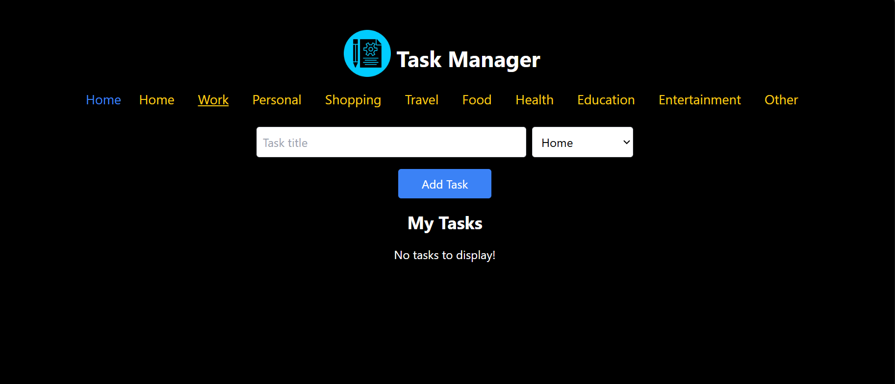
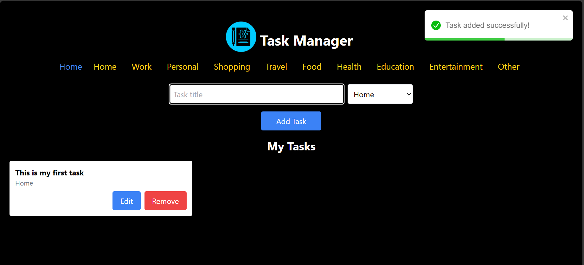
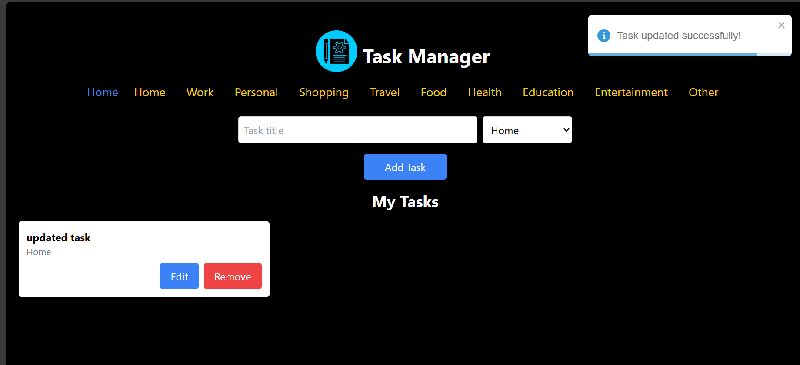
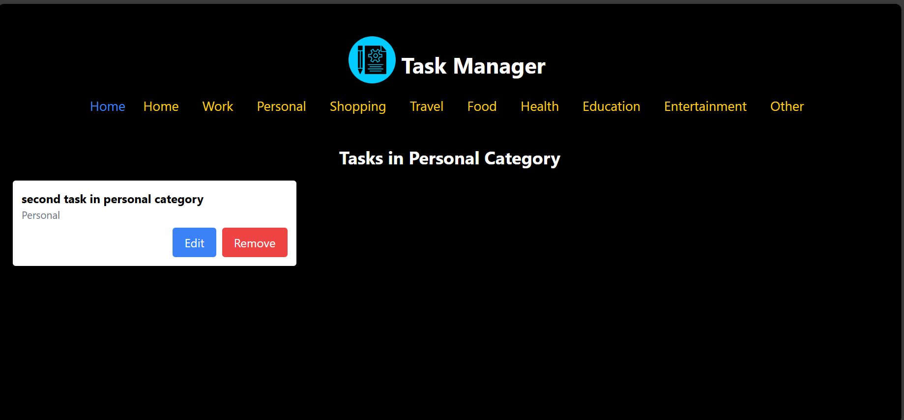
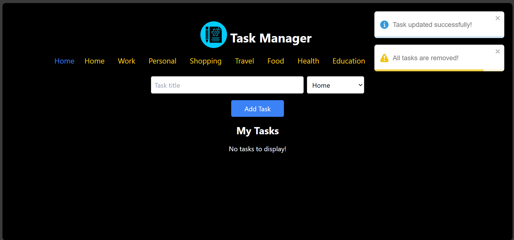

# Task Manager

**Task Manager** is a simple and responsive web application built with **React** for managing tasks. The app allows users to add, edit, and delete tasks, as well as categorize them. It uses **local storage** for persistence and provides **toast notifications** for task-related actions. The app is designed with **Tailwind CSS** to ensure a clean, responsive layout for both mobile and desktop devices.

## Features

- **Add Tasks**: Create tasks by entering a title and selecting a category.
- **Edit Tasks**: Modify the title or category of existing tasks.
- **Delete Tasks**: Remove tasks from the list.
- **Categories**: Tasks can be categorized for better organization.
- **Toast Notifications**: Display success or error notifications when adding, editing, or deleting tasks.
- **Responsive Design**: Fully responsive UI that works well on both desktop and mobile devices.
- **Local Storage**: Tasks are saved in local storage for persistence across page reloads.

## Screenshots


_**Home Page**: View of the main task management screen._


_**Add Task**: Form for creating a new task._


_**Category View**: Tasks organized by category._


_**Home Page**: View of the update of task screen._


_**Category View**: Tasks of a particular category._


_**Home Page**: View of the empty list when all tasks are cleared._

## Technologies Used

- **React**: A JavaScript library for building user interfaces.
- **React Router**: For handling navigation between different views.
- **Tailwind CSS**: A utility-first CSS framework for styling the app.
- **React Toastify**: A library for adding toast notifications.
- **Local Storage**: For saving tasks and ensuring persistence across sessions.

## Installation

To run this project locally, follow the instructions below:

### 1. Clone the repository

```bash
git clone https://github.com/your-username/task-manager.git
